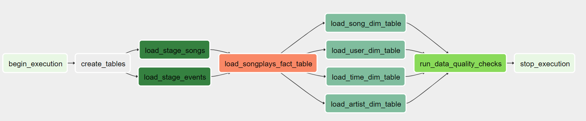

## Data Pipelining with Airflow

This repository provides the ETL pipeline, to ingest sparkify's music data into an AWS Redshift Data Warehouse. The ETL pipeline will be run on an hourly basis, scheduled using Airflow.

* Airflow allows workflows to be defined as code, they become more maintainable, versionable, testable, and collaborative

* The purpose of this database is to enable Sparkify to answer business questions it may have of its users, the types of songs they listen to and the artists of those songs using the data that it has in logs and files. The database provides a consistent and reliable source to store this data.

* This source of data will be useful in helping Sparkify reach some of its analytical goals, for example, finding out songs that have highest popularity or times of the day which is high in traffic.

## Dependencies

* To install Airflow, run `pip install airflow`

* To use postgres to store metadata from airflow jobs, edit airflow.cfg file under the AIRFLOW_HOME dir. 

* Run: `airflow webserver -p 8080`. 

* Configure aws_credentials in Airflow using access and secret access keys. (under Airflow UI >> Admin >> Connections)

* Configure redshift connection in Airflow (under Airflow UI >> Admin >> Connections)

## Database Design and ETL Pipeline

* For the schema design, the STAR schema is used as it simplifies queries and provides fast aggregations of data.

* There are 2 types of data involved, song and log data. For song data, it contains information about songs and artists, which we extract from and load into users and artists dimension tables

* Log data gives the information of each user session. From log data, we extract and load into time, users dimension tables and songplays fact table.

## Running the ETL Pipeline

* Turning on the sparkify_music_dwh_dag DAG in Airflow UI will automatically trigger the ETL pipelines to run.
* DAG is as such (from graph view):

