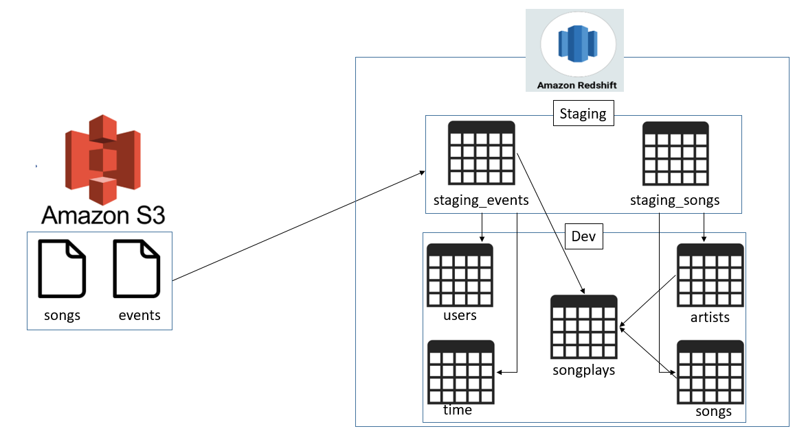

## Data Warehousing with AWS Redshift

This repo provides the ETL pipeline, to populate the sparkifydb database in AWS Redshift.  
* Redshift is a fully managed, cloud-based, petabyte-scale data warehouse service by Amazon Web Services (AWS). It is an efficient solution to collect and store all data and enables analysis using various business intelligence tools to acquire new insights for businesses and their customers.  

## Database Design
* For the schema design, the STAR schema is used as it simplifies queries and provides fast aggregations of data.

* songplays is our facts table with the rest being our dimension tables.

## Data Pipeline design
* There are 2 types of data involved, song and log data. For song data, it contains information about songs and artists, which we extract from and load into users and artists dimension table

* First, we load song and log data from JSON format in S3 into our staging tables (staging_songs_table and staging_events_table)

* Next, we perform ETL using SQL, from the staging tables to our fact and dimension tables. Below shows the architectural design of this pipeline:

## Files
* create_tables.py is the python script that drops all tables and create all tables (including staging tables)

* sql_queries.py is the python file containing all SQL queries. It is called by create_tables.py and etl.py

* etl.py is the python script that loads data into staging tables, then load data into fact and dimension tables from staging tables

* redshift_cluster_setup.py sets up the redshift cluster and creates an IAM role for redshift to access other AWS services

* redshift_cluster_teardown.py removes the redshift cluster and IAM role created

* dwh.cfg contains configurations for Redshift database. Please edit according to the Redshift cluster and database created on AWS

## Running the ETL Pipeline
* First, run create_tables.py to create the data tables using the schema design specified. If tables were created previously, they will be dropped and recreated.

* Next, run etl.py to populate the data tables created.
